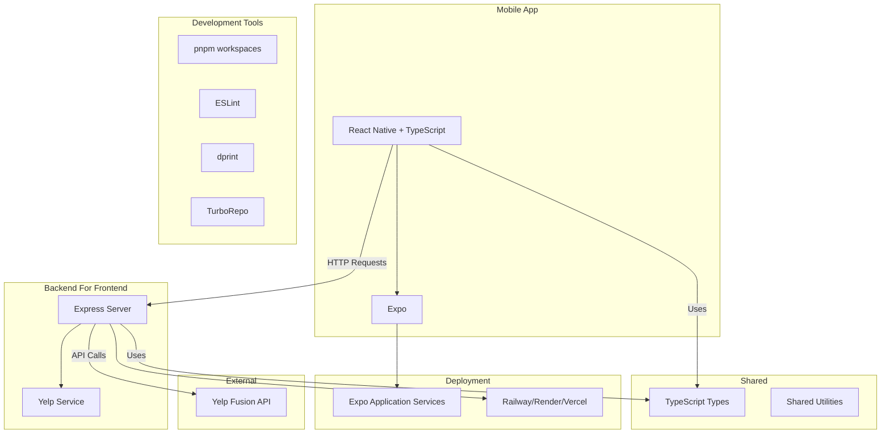

# Night Owl

A React Native application to find late-night coffee shops using the Yelp API.

## Architecture



## Project Structure

```
night-owl/
├── apps/
│ ├── mobile/     # React Native + Expo app
│ └── backend/    # Express-based BFF
├── packages/
│ └── shared/     # Shared TypeScript types/utilities
├── pnpm-workspace.yaml
└── turbo.json    # Build/task orchestration
```
